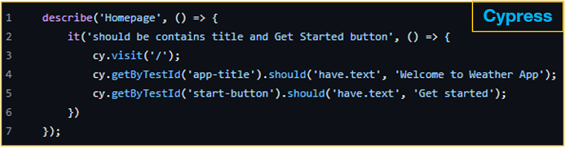
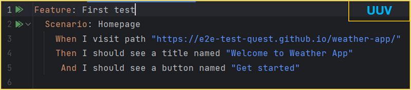
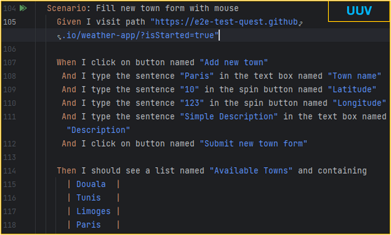
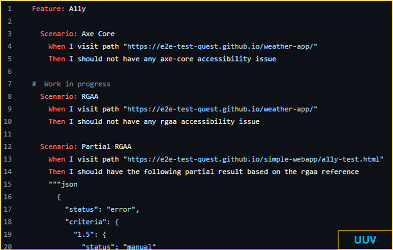

# Arrêtons de (dé)tester nos applications web

Dans ce billet, nous allons discuter d'un sujet crucial pour les développeurs et les testeurs : la pertinence des tests de bout en bout web. 
En effet, lorsqu'il s'agit de tester des applications web, les tests automatisés jouent un rôle vital car ils peuvent être exécutés à plusieurs reprises sans effort et manuel supplémentaire. Parmi les tests automatisés, les tests end-to-end (E2E) sont particulièrement importants car ils simulent des cas d'utilisation réels. Cependant, il existe des pratiques courantes qui limitent la pertinence de ces tests. 
Nous allons ici examiner 3 mauvaises pratiques, ou erreurs courantes, qui limitent la pertinence de vos tests de bout en bout.

## 1. Ecrire des tests developer-centric

La première erreur courante que l'on peut citer est de rédiger des tests E2E centrés sur le développeur. 
Pour comprendre ce que nous entendons par test E2E centré sur le développeur, prenons un exemple. 
Imaginons que je souhaite écrire un test pour vérifier que le titre « Welcome to weather App » et le bouton « Get Started » sont bien présents sur la page web suivante :  
 
Avec un outil populaire comme Cypress, je peux écrire le test suivant : 
 
Et ça marche ! Mais ce test a, au moins, les 2 limitations suivantes :
 - Il est écrit en **Typescript** : Il n'est donc pas facile à comprendre pour les non-développeurs (par non-développeur on entend toute personne qui ne comprend pas du code de programmation), et c'est un peu dommage car il est censé représenter un cas d'utilisation réel.
 - Utilisation de **testId** : les testIds sont des attributs ajoutés par les développeurs pour faciliter la localisation des éléments de la page lors des tests.

Mais lorsqu'on les utilise dans nos tests, nous n'interagissons pas avec notre application comme un utilisateur final. Nos utilisateurs finaux ne connaissent pas les ID de test, ils connaissent les boutons, les liens, les champs de formulaire, ils connaissent tout ce qu'ils peuvent voir et/ou entendre. 

Alors, comme bonne pratique, adoptons une approche centrée sur l'utilisateur(user-centric), qui consiste à utiliser des éléments connus de l'utilisateur final pour interagir comme il le ferait avec notre application.
Cet exemple montre le même test écrit avec la solution UUV.
 
Le nom et le rôle accessibles sont utilisés pour exprimer le cas d'utilisation dans un langage anglais simple.

## 2. Oublier l'utilisation du clavier

La seconde erreur courante est de négliger l'usage du clavier lors des tests. Les directives WCAG stipulent que tous les éléments interactifs doivent être accessibles via une interface clavier. Cela profite non seulement aux personnes ayant des handicaps visuels ou moteurs, mais aussi à ceux qui préfèrent utiliser le clavier pour des raisons de productivité. 
Pour remplir un formulaire comme celui-ci : 
 
Les utilisateurs déplacent naturellement une souris pour naviguer, car c'est l'usage par défaut qui est enseigné pour manipuler un ordinateur. Les développeurs ont donc l'habitude de reproduire ce genre de scénario lors de tests E2E, comme sur cet exemple : 
 
Pour les plus expérimentés d'entre nous, la navigation au clavier est un excellent moyen d'augmenter la productivité. Ainsi lorsque nous testons nos applications, une bonne pratique est de vérifier l'usage du clavier. Pour cet exemple, il convient donc de vérifier le remplissage du formulaire au clavier. Voici un scénario écrit avec l'outil UUV pour le faire :  
 

La première partie est identique à la navigation à la souris. Ensuite, nous plaçons le focus sur le coin gauche de l'application. Puis nous déplaçons le focus lorsque nous appuyons sur la touche tabulation et nous vérifions que le focus est sur le lien nommé weather App's logo. Nous reproduisons ce mécanisme avant de le soumettre.

## 3. Ignorer l'accessibilité (#a11y)

Contrairement à ce que l'on pourrait croire, les tests E2E sont un excellent contexte pour effectuer des vérifications d'accessibilité en utilisant des outils comme axe-core pour effectuer des contrôles de référence WCAG, ou en utilisant des bibliothèques comme `uuv/a11y` pour les vérifications RGAA. Il est important de garantir la non-régression de l'accessibilité lorsque l'on met à jour nos interfaces, surtout à une époque où l'intelligence artificielle prend de plus en plus de place. 

Voici un exemple de scénarios effectuant des vérifications d'accessibilité :  
 

## En résumé

Commencer ou continuer à :
 - Ecrire des tests **user-centric**
 - Tester l'utilisation du **clavier**
 - Effectuer des vérifications d'**accessibilité**

En adoptant ces pratiques, nous pouvons nous assurer que nos applications web sont robustes, accessibles et prêtes pour une utilisation réelle par tous nos utilisateurs.

### Mais au fait, qu'est-ce que uuv ?
 
Pour faire simple, <a href="https://orange-opensource.github.io/uuv" target="_blank">UUV</a> est une solution opensource qui facilite l'application des pratiques évoquées et de bien d'autres en matière de tests E2E. 
Disponible en tant que dépendance npm, UUV offre des phrases prêtes à l'emploi **user-centric** pour rediger les tests E2E. Pour les développeurs, <a href="https://orange-opensource.github.io/uuv/docs/getting-started/configuration#ide-plugins" target="_blank">le plugin Jetbrains et l'extension VS Code</a> facilite l'écriture des scénarios. De plus, <a href="https://orange-opensource.github.io/uuv/docs/tools/uuv-vscode-extension" target="_blank">l'assistant UUV</a>, une application de bureau, permet de générer des scénarios de tests comme ceux pour vérifier la navigation au clavier, les interactions avec les boutons, et bien plus encore.  

Vous pouvez tester UUV directement sur vos projets ou à l'aide du <a href="https://github.com/e2e-test-quest/kata-e2e-uuv" target="_blank">Kata UUV E2E</a> et contribuer à son développement sur <a href="https://github.com/Orange-OpenSource/uuv" target="_blank">GitHub</a>.

Merci pour votre lecture, n'hésitez pas à partager votre avis en commentaire !